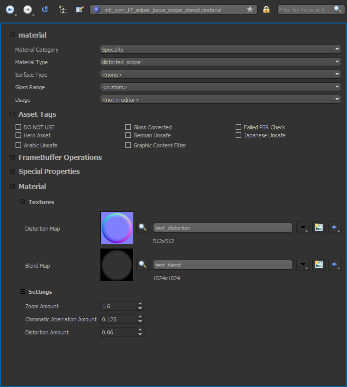
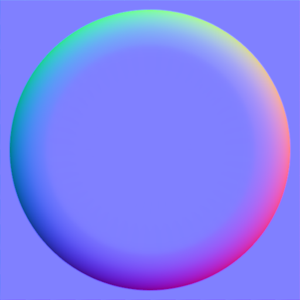

# 🔭 Bo3MWStyleScope 🔭

This repo holds a basic shader for use with Black Ops III weapons that mimics Modern Warfare's zoomed scope shader with a vignette. The distortion can be controlled by a normal map and some settings. The vignette is handled by a "blend map" that 

# Installation

To install download the latest [Release](https://github.com/Scobalula/Bo3MWStyleScope/releases) and unpack the zip file to Black Ops III's directory. Once done you can move on to usage, it's that simple!

# Usage

Using the scope shader is very simply, it can be a drop in replacement for your scope's `stencil` material that unblurs the lens section of the screen. To do this, set the material you're using for your scope to:

```
Material Catagory: Specialty
Material Type: distorted_scope
```

Once done, you can assign a normal map to handle distortion, if you don't want distortion, leave this blank and set the Distortion Amount to `0`. To control the zoom, simply set the zoom value to what you want. If you decide to use distortion, you'll need to make sure your mesh has suitable UVs and is towards the front of the gun on top of everything else.

The vignette is controlled via a "blend map" that you can assign, if you don't want the vignette set this to $whitetransparent_color or pull an older version from the releases.

For example (included in repo as an example):



Normal Map Example (thanks to Kurururu):



Blend Map Example:


# Keylines

Unfortunately due to how keylines are handled by default in Black Ops III, they may remain at their normal scale and look like they are floating. This cannot be fixed right now and doesn't cause a lot of issues so it's unlikely to be a focus to waste time on. Focus on the zombies.

# Reporting Problems

❤️ You can also join my Discord to report issues or get general help ❤️

[](https://discord.gg/RyqyThu)

# Credits

If you use the script there is no requirement to credit me, focus on making your projects extra spicy. 🌶️

# Preview

